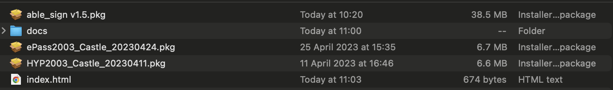
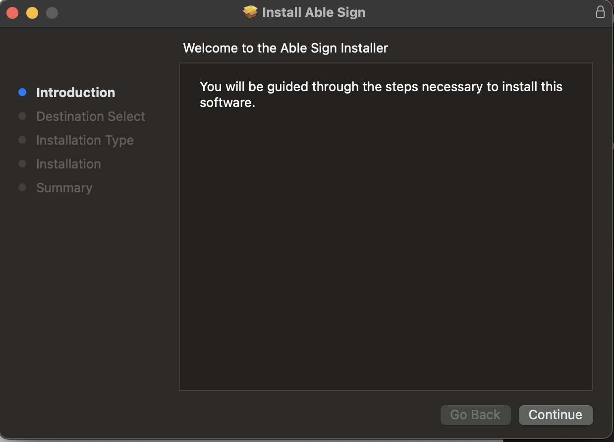
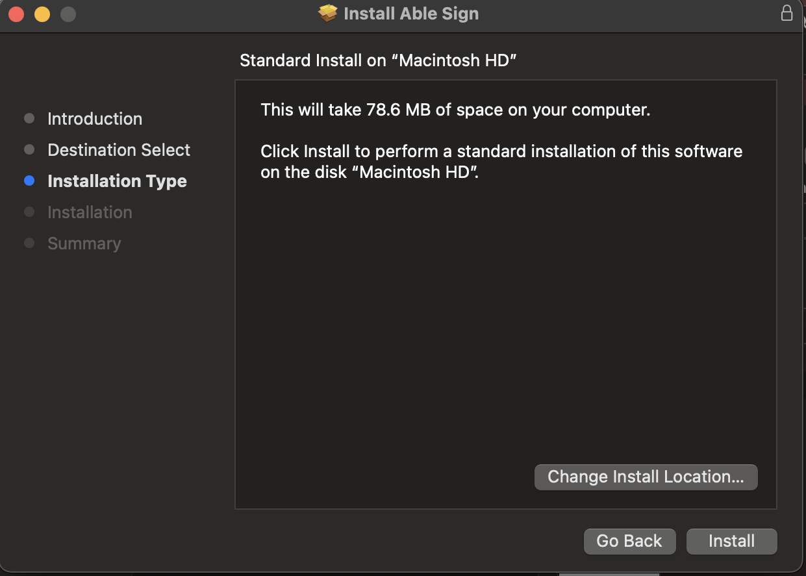
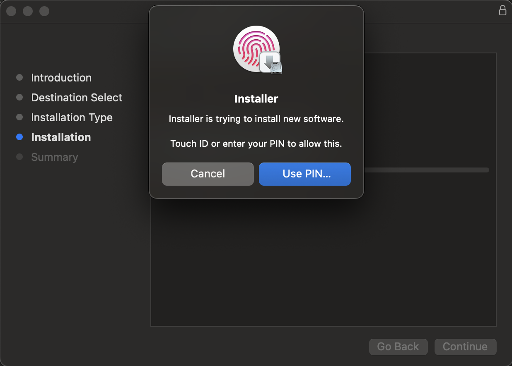
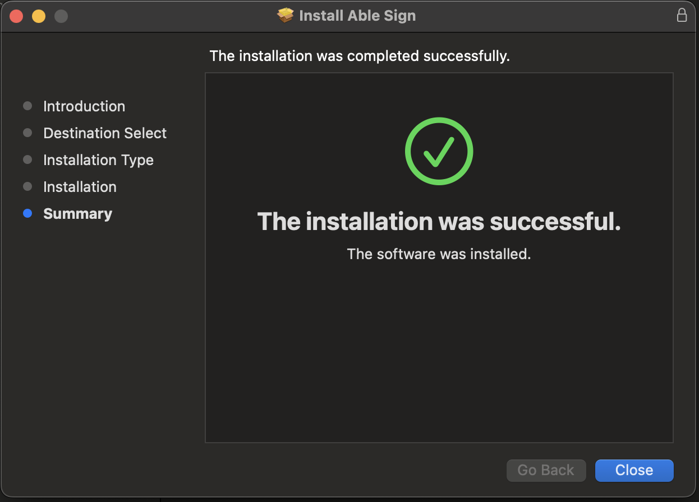
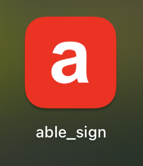

# Able Sign v1.5 суулгах заавар

- Та эхлээд Tridium болон MonPass драйверүүдийг суулгах хэрэгтэй. Хэрэв та эдгээр драйверүүдийг суулгаагүй бол дараах холбоосоор орж суулгах зааврыг дагаж хийнэ үү.

  - [Tridium](tridium.md)
  - [MonPass](monpass.md)

- **Able Sign v1.5** суулгахад дараах алхамуудыг дагаж хийнэ үү.

1. Дараах нэртэй **able_sign v1.5.pkg** файлыг сонгон давхар дарж нээнэ.

    

2. **Installer** гарч ирсэн бол дараах зааврыг дагаж хийнэ үү.

    
    
    
    

3. **Close** дарж суулгалтыг дуусгана уу.
4. Амжилттай суусан бол **able_sign** нь **Finder/Applications** хавтас руу нэмэгдэнэ.

    

5. **Able Sign** нээхээс өмнө та аль нэг драйверийг суулгасан байх шаардлагатайг анхаарна уу.
