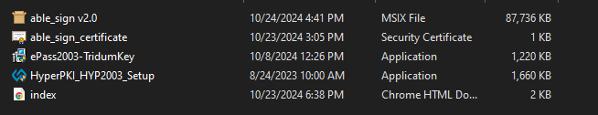
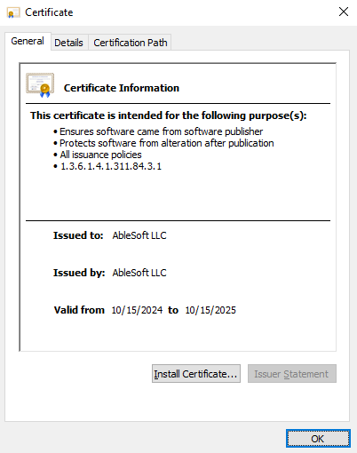
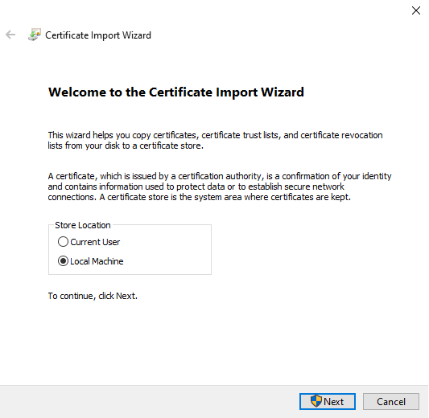
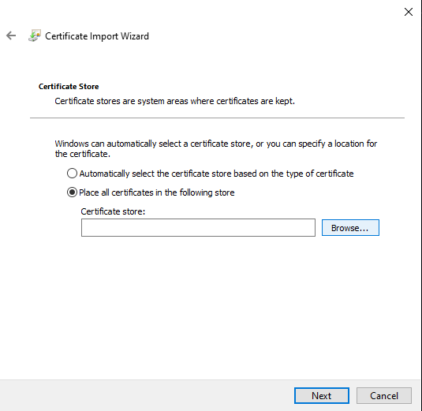
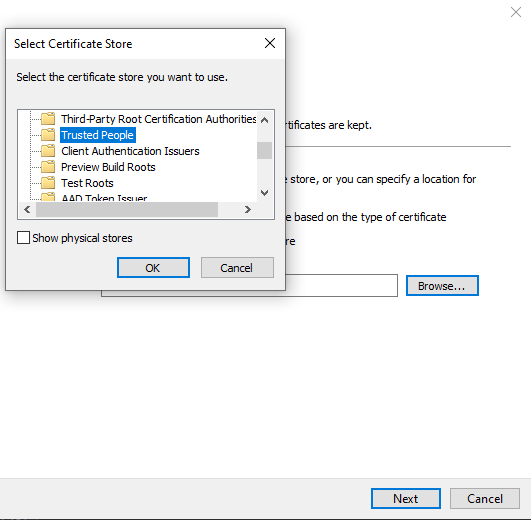
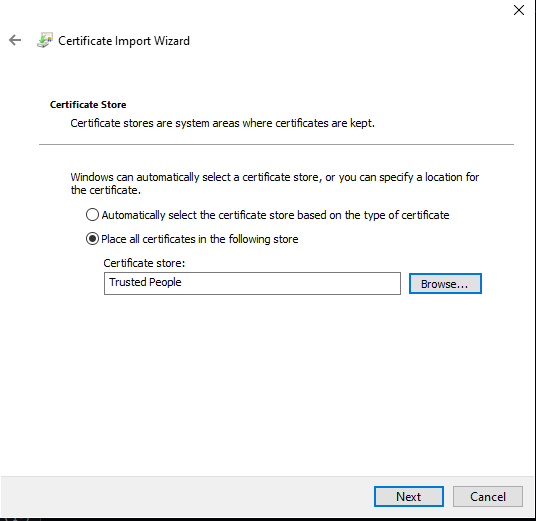
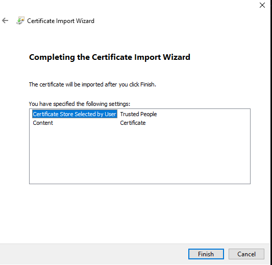
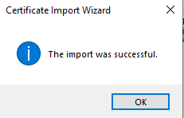
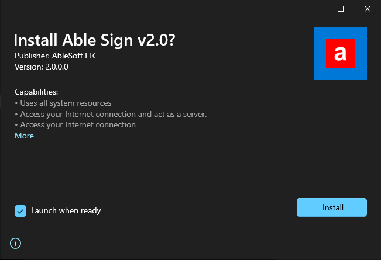

# Able Sign v2.0 суулгах заавар

- Та эхлээд Tridium болон MonPass драйверүүдийг суулгах хэрэгтэй. Хэрэв та эдгээр драйверүүдийг суулгаагүй бол дараах холбоосоор орж суулгах зааврыг дагаж хийнэ үү.

  - [Tridium](tridium_windows.md)
  - [MonPass](monpass_windows.md)

- **Able Sign v2.0** суулгахад дараах алхамуудыг дагаж хийнэ үү.

1. Дараах нэртэй **able_sign_certificate.cer** файлыг сонгон давхар дарж нээнэ.

   

2. Дараах зааврыг дагаж хийнэ үү.

   - 
   - 
   - 
   - 
   - 
   - 
   - 

3. Амжилттай суусан бол **able_sign v2.0.msix** файлыг сонгон давхар дарж нээнэ.

   

   

4. **Install** дарж суулгана уу.

5. **Able Sign** нээхээс өмнө та аль нэг драйверийг суулгасан байх шаардлагатайг анхаарна уу.
