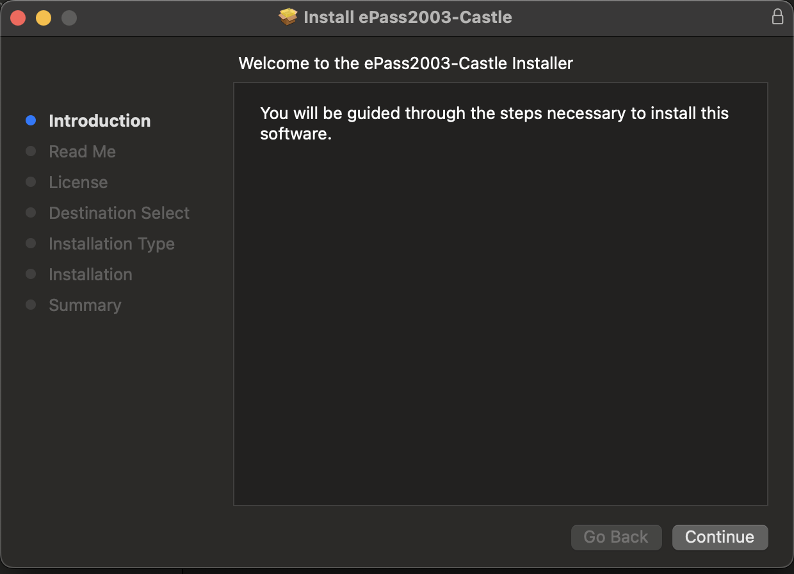
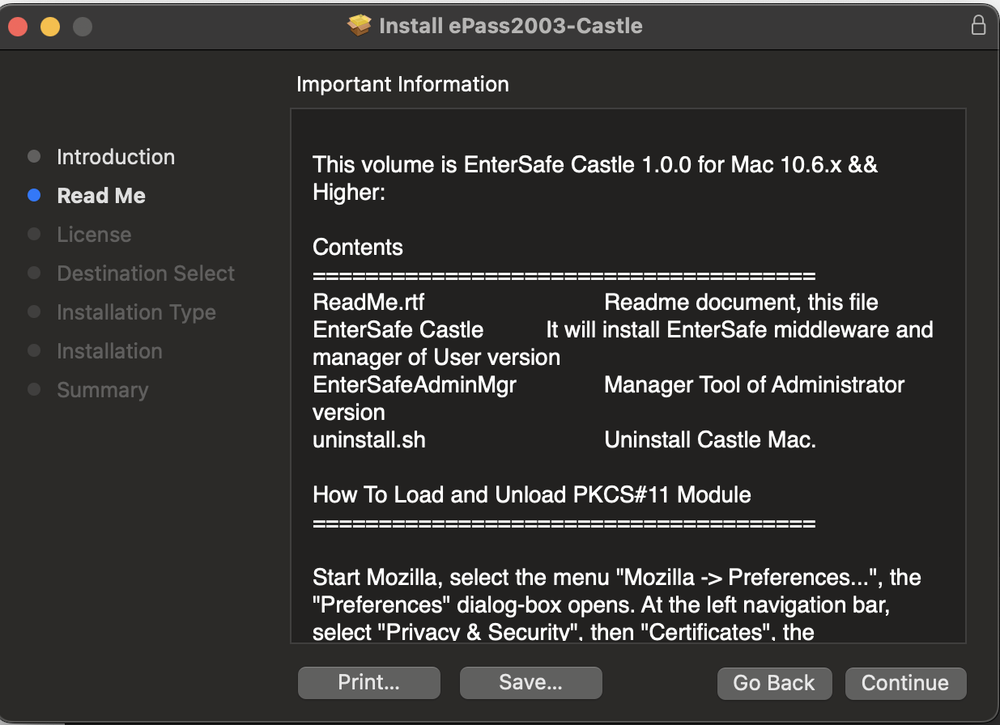
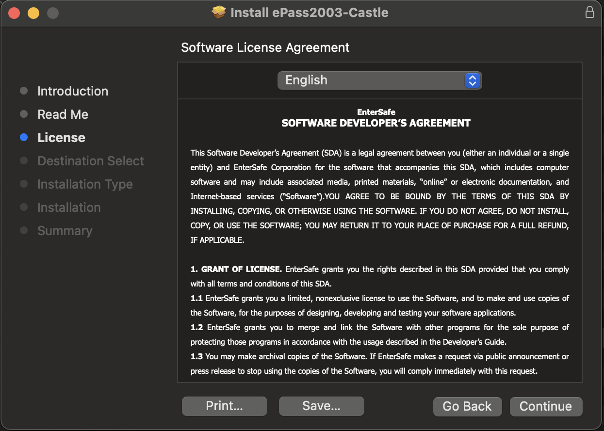
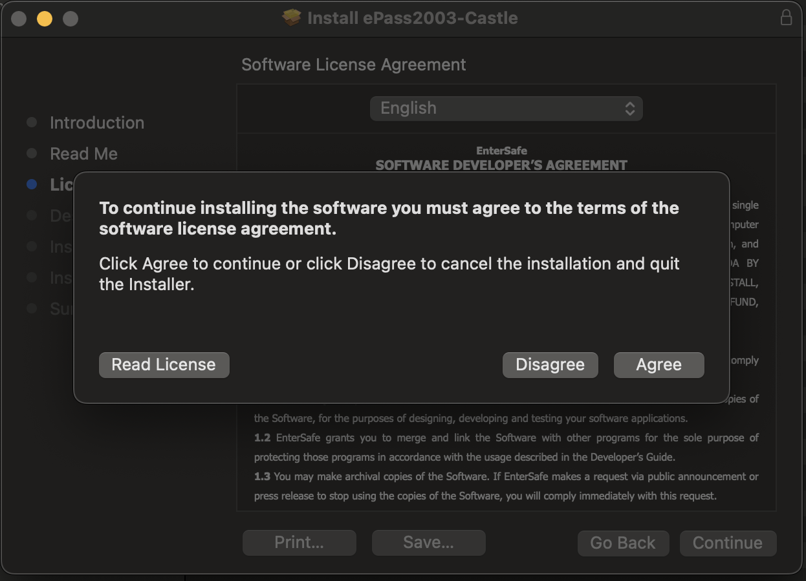
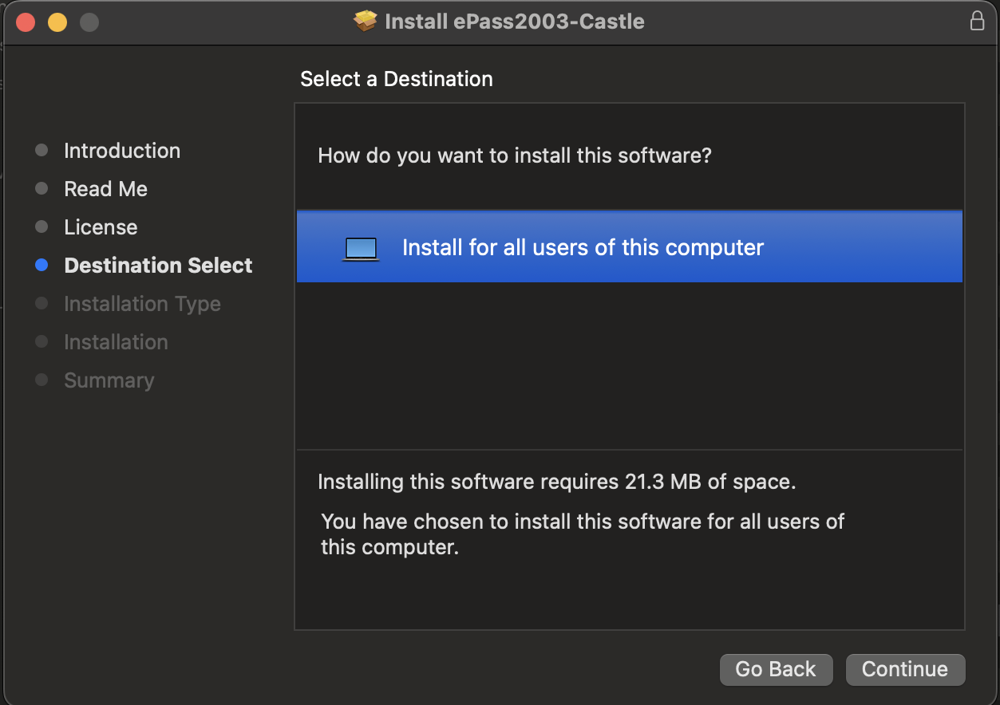
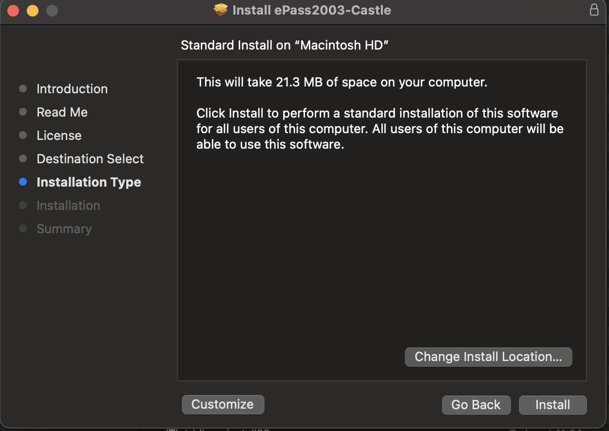
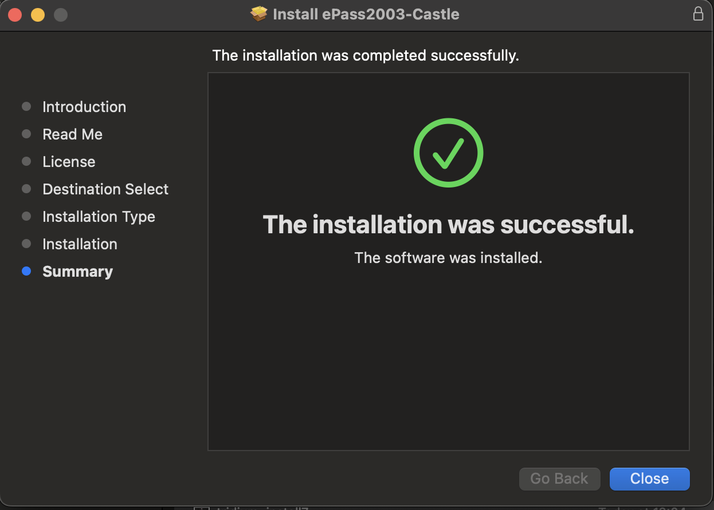
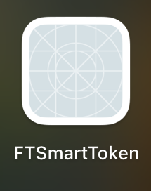
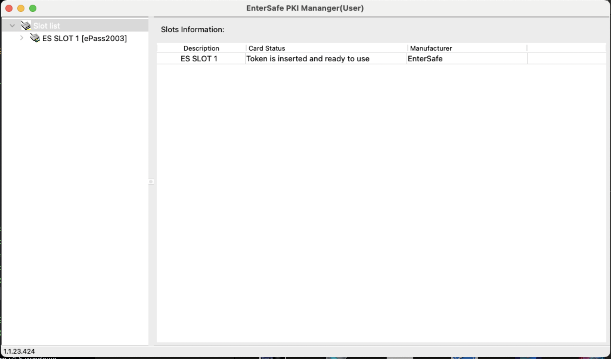

# Tridim драйвер суулгах заавар

- Дараах алхамуудыг дагаж хийнэ үү.

1. Дараах нэртэй **ePass2003_Castle_20230424.pkg** файлыг сонгон давхар дарж нээнэ.

   

2. **Installer** гарч ирсэн бол дараах зааврыг дагаж хийнэ үү.

   
   
   
   
   
   
   
   

3. **Close** дарж суулгалтыг дуусгана уу.
4. Амжилттай суусан бол дараах програмууд нь **Finder/Applications** хавтас руу нэмэгдэнэ.

   
   

5. **EnterSafeCastleUserMgr** нээхээс өмнө та **MonPass** драйверийг суусан байвал устгах хэрэгтэй.
6. **Finder/Applications** хавтас руу орж дараах програмууд байвал устгах хэрэгтэй.

   
   

7. **EnterSafeCastleUserMgr** нээнэ үү.
8. Хэрэв та **EnterSafeCastleUserMgr** програмыг амжилттай нээсэн бол өөрийн токеныг холбоно уу. Токен амжилттай холбогдсон дараах байдалтай харагдана.

   

9. Үүний дараа та **Able Sign** програмыг ажиллуулахад бэлэн болно.
   - **Able Sign** програмыг ажиллуулахад токен амжилттай холбогдсон байх шаардлагатай.
   - Та драйверийг нэг суулгасан бол дахин суулгах шаардлагагүй. Шууд ажиллуулах боломжтой.
