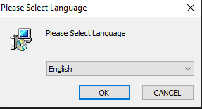
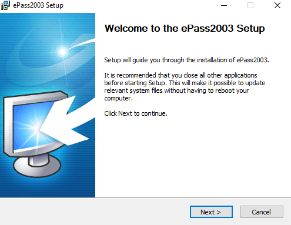
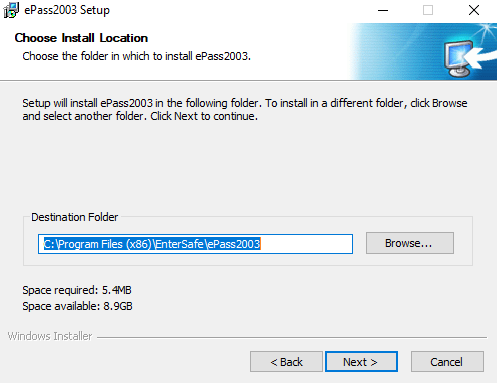
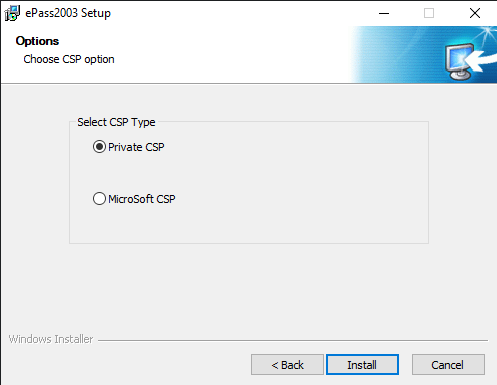

# Tridim драйвер суулгах заавар

- Дараах алхамуудыг дагаж хийнэ үү.

1. Дараах нэртэй **ePass2003-TridumKey.exe** файлыг сонгон давхар дарж нээнэ.

   

2. Дараах зааврыг дагаж хийнэ үү.

   - 
   - 
   - 
   - 
   - 

3. **Finish** дарж суулгалтыг дуусгана уу.

4. Үүний дараа та **Able Sign** програмыг ажиллуулахад бэлэн болно.
   - **Able Sign** програмыг ажиллуулахад токен амжилттай холбогдсон байх шаардлагатай.
   - Та драйверийг нэг суулгасан бол дахин суулгах шаардлагагүй. Шууд ажиллуулах боломжтой.
